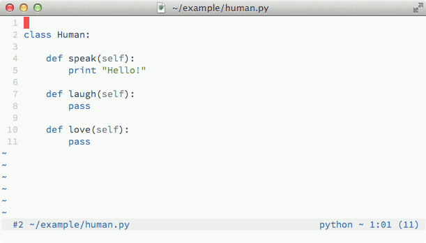

# Tag Surfer

Fuzzy tag searches for Vim.
   


## Installation

**Step 1:** First, check if your system meets the following requirements:

* Linux, Mac OS, Windows
* Vim 7.3+ compiled with python 2.x
   
**Step 2:** Get [Exuberant Ctags](http://ctags.sourceforge.net/). You can check 
if it is already installed on your system with

    $ ctags --version. 

If you don't see the *Exuberant Ctags* string somewhere in the ouput then you
need to install it:
    
* **Windows:** You can easily get the `ctags.exe` executable from
[http://ctags.sourceforge.net](http://ctags.sourceforge.net).

* **Linux:** You may want to check out specific instructions for your
distribution.

* **Mac:** Unfortunately, the *ctags* program that you may find under
`/usr/bin` is outdated so you better get the new version using
*homebrew* (`brew install ctags`). 

Just be sure that once installed, the *ctags* executable can be found in your
`$PATH` (or `%PATH%` for Windows users). Usually *Tag Surfer* is able to locate
the correct *ctags* binary by himself. If this is not the case, set the 
option `g:tsurf_ctags_bin` in your `.vimrc`:   

    let g:tsurf_ctags_bin = "/path/to/my/ctags"  
  
**Step 3:** Copy the content of the *Tag Surfer* folder into your `~/.vim` 
directory or install the plugin with a plugin manager (recommended) such as
[Vundle](https://github.com/gmarik/vundle), [Pathogen](https://github.com/tpope/vim-pathogen) 
or [Neobundle](https://github.com/Shougo/neobundle.vim).

**Step 4:** **[Only for non-Windows users]** Compile the "search" component: 

    $ ./complete-installation.sh

This will compile some C files needed for better search performances.

I'm sorry for Windows users but there is no support for compiling thes
files on your system. But don't worry, this does not means *Tag
Surfer* won't work but just that searches won't be as fast as with these
files compiled.


## Usage

Using *Tag Surfer* is straightforward. To search for tags in all open buffers
execute the `:Tsurf` command and a window will appear with all results for your
search query.  You can start to interact with the results with the following
keys.

* `UP`, `TAB`, `CTRL+K`: move up.
* `DOWN`, `CTRL+J`: move down.
* `RETURN`, `CTRL+O`, `CTRL+G`: jump to the selected tag.
* `CTRL+P`: open a preview window for the selected tag.
* `CTRL+S`: split the window for the selected tag.
* `ESC`, `CTRL+C`: close the search results list.
* `CTRL+U`: clear the current search.

Rememberer that when you jump to a tag you can easily jump back to the previous
position pressing `CTRL+T`, just as you would normally do in Vim! 

### Search scope

Searches are not limited to loaded buffers. You can narrow or widen the
search scope using modifiers. A modifier is simply a special letter that you
prepend to your search query. Below is list of all available modifiers:

* `%`: this modifier narrows the search scope to the current buffer.
* `#`: this modifier widens the search scope to all files of the current
project. Note that a project root is assumed to be the one that contains 
any of the file or directory names listed in the `g:tsurf_root_markers` 
option (by default these are `.git`, `.svn`, `.hg`, `.bzr` and `_darcs`).

You may find useful setting in your `vimrc` something like this:

```vim
nnoremap <leader>b :Tsurf<CR>%
nnoremap <leader>p :Tsurf<CR>#
```

### Languages support

*Exuberant Ctags* only supports a limited set of languages. You can check what
languages are supported with

    $ ctags --list-languages

If your favorite language is not listed in the output of the previous command,
the easiest way to add support for it in *Tag Surfer* is to search for
a *ctags-compatible* program that can generate tags for that language. *Tag
Surfer* provides the `g:tsurf_custom_languages` option to easily integrate a custom
*ctags-compatible* program for non-supported languages:

```vim
let g:tsurf_custom_languages = {
    \ "<filetype>" : {
        \ "bin": "/path/to/my/custom/ctags",
        \ "args": "--arguments for the --custom ctags",
    \ }
\}
```

With the *bin* and *args* you can set the path of custom *ctags* program and
its arguments respectively.  In order to make things work you have to be sure
that the output of the custom *ctags-compatible* program is will be **sorted**
and redirected to **stdout**, so you may need to set the arguments accordingly.

```vim
let g:tsurf_custom_languages = {
    \ "<filetype>" : {
        \ "extensions": [".ext1", ".ext2"],
    \ }
\}
```

Setting the *extensions* key is paramount. This is a list of file extensions
used by `<filetype>` source files. 

Other minor customizations require you to set a couple of others keys:

```vim
let g:tsurf_custom_languages = {
    \ "<filetype>" : {
        \ "exclude_kinds": ["constant", "variable"]
    \ }
\}
```

With the `exclude_kinds` key you can set exclusion rules based on the kind of the tag. 
For example, the code above will exclude all tags with the kind `constant` or `variable`
from search results for files with the filetype `<filetype>`. 

```vim
let g:tsurf_custom_languages = {
    \ "<filetype>" : {
        \ "kinds_map": {"c":"constant", "v":"variable"}
    \ }
\}
```

Setting the `kinds_map` key may be required when your custom *ctags* prgram
displays only single letters for the *kind* field and you want more readable
names.


## Contributing

Do not esitate to send [patches](../../issues?labels=bug&state=open),
[suggestion](../../issues?labels=enhancement&state=open) or just to ask
[questions](../../issues?labels=question&state=open)! There is always
room for improvement.


## Credits

See [this page](https://github.com/gcmt/tag-surfer/graphs/contributors) for all
*Tag Surfer* contributors. 


## Changelog

See [CHANGELOG.md](CHANGELOG.md).


## License

Copyright (c) 2013 Giacomo Comitti

Permission is hereby granted, free of charge, to any person obtaining a copy of
this software and associated documentation files (the "Software"), to deal in
the Software without restriction, including without limitation the rights to
use, copy, modify, merge, publish, distribute, sublicense, and/or sell copies
of the Software, and to permit persons to whom the Software is furnished to do
so, subject to the following conditions:

The above copyright notice and this permission notice shall be included in all
copies or substantial portions of the Software.

THE SOFTWARE IS PROVIDED "AS IS", WITHOUT WARRANTY OF ANY KIND, EXPRESS OR
IMPLIED, INCLUDING BUT NOT LIMITED TO THE WARRANTIES OF MERCHANTABILITY,
FITNESS FOR A PARTICULAR PURPOSE AND NONINFRINGEMENT. IN NO EVENT SHALL THE
AUTHORS OR COPYRIGHT HOLDERS BE LIABLE FOR ANY CLAIM, DAMAGES OR OTHER
LIABILITY, WHETHER IN AN ACTION OF CONTRACT, TORT OR OTHERWISE, ARISING FROM,
OUT OF OR IN CONNECTION WITH THE SOFTWARE OR THE USE OR OTHER DEALINGS IN THE
SOFTWARE.
